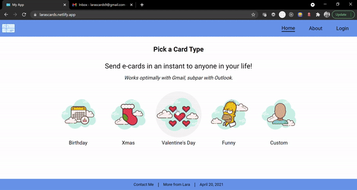
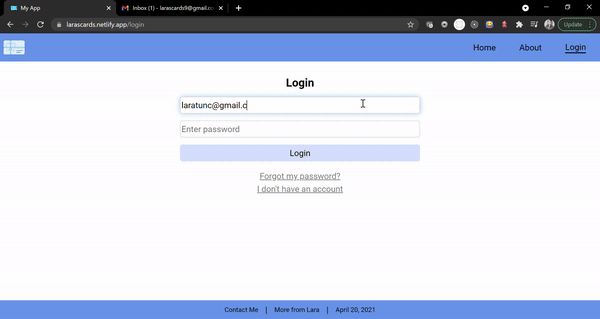

# Lara's Cards

Welcome to my app!\
It's called Lara's Cards. It will enable the user to send styled e-cards. There are several different types of pre-made e-cards to choose from with the ability to insert custom messages.
I built this app when I could not find any free e-card providers to send e-cards to my friends. So I built one myself.\
I hope you enjoy using it :)

Please note that results in Outlook are sub-par. Gmail recommended.

https://larascards.netlify.app/

# Functionality

Browsing

Sending a card

Validation

Signup

Account details and history

# Special thanks

I would like to thank Concordia Bootcamps- Journey for giving the best bootcamp education out there.
Special thanks to my teaching instructor Tiffany Dow. She is an immensely talented instructor and developer. \
Also special thanks to my teaching coaches Diana Chiu, Richard Bonneau, and Bryce Hamilton who patiently answered all my questions and helped every step of the way. \
It was my honour to be learning from all of them :)

# Notes

This project was bootstrapped with [Create React App](https://github.com/facebook/create-react-app).
